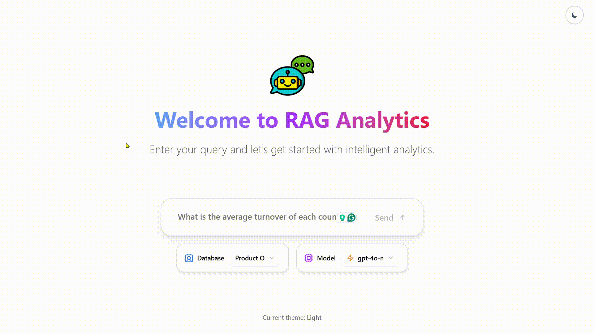

# RAG Analytics

Fullstack AI + Data integration project performs a “Text-To-SQL” query using LLMs ChatGPT, Claude and Ollama over a small dataset stored locally. More data can be added.




## Key Highlights

- 💬 **Fullstack Application**: Combines a React frontend with a LangGraph backend, representing each state of execution as a node.
- 🤔 **Automatic Routing**: Identifies which action to perform (RAG-based or analytics), addresses knowledge gaps, and refines searches.

- The data files are located in the `backend/data` folder (including `products.csv` and `rules.md`), from which the store folder is created containing SQLite databases for both files and embeddings.

- The project is organized into two main directories:

  - `frontend/`: Contains the React application built with Vite.
  - `backend/`: Contains the LangGraph/FastAPI application, including the agent logic.

Here's what the program does:

1. **Data Ingestion & Indexing**: Raw data is ingested and indexed into a vector store.
2. **Context Retrieval**: Retrieves relevant context for free-text questions.
3. **Ad-hoc Analytics**: Performs SQL-style queries for analytics.
4. **Natural Language Generation**: Generates natural-language answers via OpenAI, with a persona flag to adjust tone.
5. **HTTP API Exposure**: Exposes a simple HTTP API.
6. **Docker Containerization**: Containerizes the application for deployment.


<!--  -->

## TechStack Used

- [React](https://reactjs.org/) (with [Vite](https://vitejs.dev/)) - For the frontend user interface.
- [Tailwind CSS](https://tailwindcss.com/) - For styling.
- [Shadcn UI](https://ui.shadcn.com/) - For components.
- [LangGraph](https://github.com/langchain-ai/langgraph) - For building the backend research agent.
- [Open AI](https://platform.openai.com/docs/models) - LLM for query generation and answer synthesis.


## Local Development and Testing

### Prerequisites

- **Node.js and npm** (or yarn/pnpm)
- **Python 3.11+**
- **API Keys**: The backend agent requires an OpenAI API key.
  1. Navigate to the main directory.
  2. navigate to the `backend\` folder
  3. Open the `.env` file and add your OpenAI API key: `OPENAI_API_KEY="YOUR_ACTUAL_API_KEY"` and your LangSmith API Key: `LANGSMITH_API_KEY=YOUR_API_KEY`

## Backend

Use `uv` as the package manager.


```bash
cd backend
uv sync
```

## Frontend

use npm to download node moduls
```bash
cd frontend
npm install
```

- To fix vulnerabilities if occurs 

   - To address issues that do not require attention, run:
      ```sh
      npm audit fix
      ```
   - To address all issues (including breaking changes), run:
     ```sh
     npm audit fix --force
     ```
## Run Development Servers:

**Backend:**

```bash
cd backend
uv run langgraph dev --allow-blocking
```

**Frontend:**

```bash
cd frontend
npm run dev
```

_The backend API will be available at `http://127.0.0.1:2024\docs`. It will also open a browser window to the FastAPI docs where request can be accessed. For the frontend, open a terminal in the `frontend/` directory and run `npm run dev`. The frontend will be available at `http://localhost:5173/app`_

The core of the backend is a LangGraph agent defined in `backend/src/agent/graph.py`. It follows these steps:

## Run the App

Click on `http://localhost:8123/app/` to see the application.

### Queries 
- What is the average, maximum and minimum turnover of each country?
- What is the average, maximum and minimum turnover of France? 
- What are the countries with the maximum turnover? 
- List all the countries


## Deployment

**1. Build the Docker Image:**

Notice!: You might encounter some issue when building the image, I am currently fixing the error

Run the following command from the **project root directory**: 

```bash
docker build -t hybrid-rag-service -f Dockerfile .
```

**2. Run the Production Server:**

```bash
docker-compose up
```

## Project Folder Structure 

The project is organized into two main directories:  The core of the backend is a LangGraph agent defined in backend/src/agent/graph.py. It follows these steps:

### Backend Structure
```
backend/
├── .langgraph_api/
├── src/
│   ├── agent/
│   │   ├── __init__.py
│   │   ├── app.py
│   │   ├── configuration.py
│   │   ├── graph.py
│   │   ├── router.py
│   │   └── state.py
│   ├── data/
│   │   ├── products.csv
│   │   └── rules.md
│   ├── store/
│   │   ├── analytic.sqlite
│   │   └── rag.sqlite
│   ├── wrangler/
│   │   ├── embedding/
│   │   │   ├── __init__.py
│   │   │   ├── base.py
│   │   │   └── openai.py
│   │   ├── model/
│   │   │   ├── __init__.py
│   │   │   ├── chunk.py
│   │   │   ├── document.py
│   │   │   └── product.py
│   │   ├── repository/
│   │   │   ├── __init__.py
│   │   │   ├── analytic.py
│   │   │   ├── base.py
│   │   │   ├── chunk.py
│   │   │   ├── document.py
│   │   │   └── store.py
│   │   ├── __init__.py
│   │   ├── ingest.py
│   │   ├── qa_agent.py
│   │   ├── queryTranslation.py
│   │   ├── ragUtil.py
│   │   └── repository.py
│   └── __init__.py
├── .venv/
├── test-agent.ipynb
├── uv.lock
├── .gitignore
├── langgraph.json
├── LICENSE
├── Makefile
└── pyproject.toml
```

### Frontend Structure
```
frontend/
├── node_modules/
├── public/
│   └── vite.svg
├── src/
│   ├── components/
│   │   ├── ui/
│   │   │   ├── badge.tsx
│   │   │   ├── button.tsx
│   │   │   ├── card.tsx
│   │   │   ├── input.tsx
│   │   │   ├── scroll-area.tsx
│   │   │   ├── select.tsx
│   │   │   ├── tabs.tsx
│   │   │   └── textarea.tsx
│   │   ├── ActivityTimeline.tsx
│   │   ├── ChatMessagesView.tsx
│   │   ├── InputForm.tsx
│   │   ├── TableView.tsx
│   │   └── WelcomeScreen.tsx
│   ├── lib/
│   │   └── utils.ts
│   ├── App.tsx
│   ├── global.css
│   ├── main.tsx
│   └── vite-env.d.ts
├── .gitignore
├── components.json
├── eslint.config.js
├── index.html
├── package-lock.json
├── package.json
├── tsconfig.json
├── tsconfig.node.json
└── vite.config.ts
```